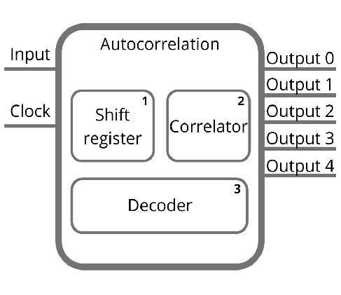

# Autocorrelation(ongoing project)
 Autocorrelation Project
 
# Block diagram

## Shift register
 Turns one-way input into 3-way output
 
## Correlator
 Autocorrelates the dada
 
## Decoder
 Decodes the result to a seven-segment display

## Contact me
 jefferson.lopes@ee.ufcg.edu.br
