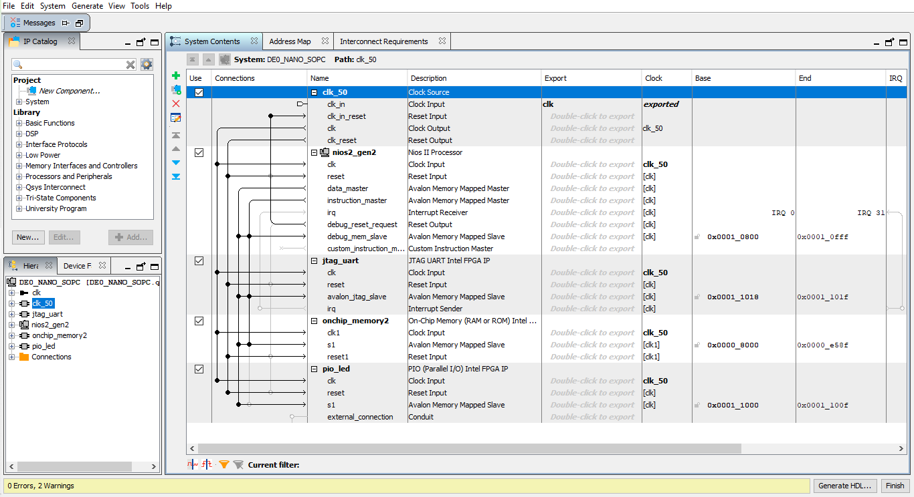
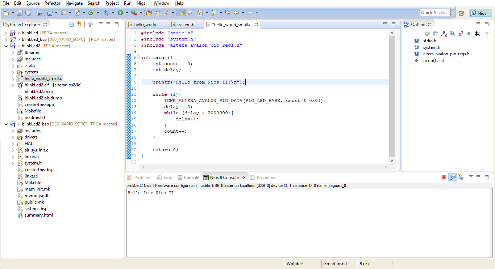

# Using C in a FPGA

This program blinks the LED using the C language, running on the built-in processor for the FPGA DE0 nano.

## Hardware description

The image below shows the modules used in conjunction with the NIOS II processor, available from Intel.

To complement the NIOS II processor and make connections with other external modules, as in this case, the LEDs of the DE0 NANO, the code in Verilog below was used.

~~~verilog
module CPUblinkLed (CLK_50, LED);
	input CLK_50;
	output [7:0] LED;
	
	DE0_NANO_SOPC DE0_NANO_SOPC_inst(
		.clk_clk(CLK_50),
		.out_port(LED)
	);
	
endmodule
~~~

## C programming

After all the hardware is finished, software development begins. In this case, C software was created to blink the first LED on the DE0 NANO board. Below is the C code used.

~~~C
#include "stdio.h"
#include "system.h"
#include "altera_avalon_pio_regs.h"

int main(){
	int count = 0;
	int delay;

	printf("Hello from Nios II!\n");

	while (1){
		IOWR_ALTERA_AVALON_PIO_DATA(PIO_LED_BASE, count & 0x01);
		delay = 0;
		while (delay < 2000000){
			delay++;
		}
		count++;
	}

	return 0;
}
~~~

## Console

The printf output used in the C code is given in the Eclipse console, as shown in the image below.

