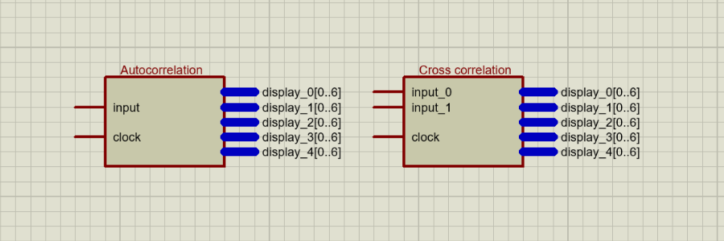

# Correlação
Este projeto implementa no FPGA um circuito para fazer a autocorrelação entre o mesmo sinal deslocado no tempo e outro circuito para fazer a correlação cruzada entre dois sinais 

## FPGA
O FPGA (field-programmable gate arrays) é um chip programável,  

## Correlação
Correlação é uma medida de similaridade entre sinais, podendo ser uma autocorrelação ou uma correlação cruzada

## Autocorrelação
É um tipo de correlação que é feita entre o sinal e ele mesmo deslocado no tempo e é expresso pela equação abaixo:

(Adicionar equação)

## Correlação cruzada
É a correlação aplicada a dois sinais, resultando na similaridade entre eles

## Entidade Top-level
As duas entidades top-level foram feitas em um arquivo .BDF, ou seja, foi feito o circuito a partir de outros blocos pré montados, como o ShiftRegister, autocorrelator e  

 

# Block diagram

## Shift register
 Turns one-way input into 3-way output

 
 
## Autocorrelator
 Autocorrelates the dada

 
 
## Decoder
 Decodes the result to a seven-segment display
 
 

## Contact me
 jefferson.lopes@ee.ufcg.edu.br
