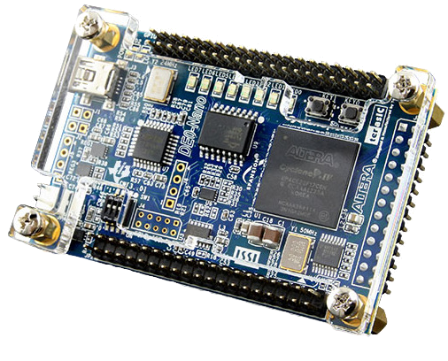

# FPGA
 Field Programmable Gate Arrays (FPGAs) are semiconductor devices that are based around a matrix of configurable logic blocks (CLBs) connected via programmable interconnects. FPGAs can be reprogrammed to desired application or functionality requirements after manufacturing.

## Hardware used
DE0-nano: Cyclone IV EP4CE22F17C6N

## References
* [Asic world](http://www.asic-world.com/)
* [FPGA course](https://www.youtube.com/playlist?list=PLZ8dBTV2_5HS79fVexGTtCMDUp7kjnumS) on YouTube
* [fpga4fun](https://www.fpga4fun.com/)

## Online compiler and software
* [EDA playground](https://www.edaplayground.com/)
* [Quartus Prime](https://fpgasoftware.intel.com/19.1/?edition=lite&platform=windows)

## Contact me
  
